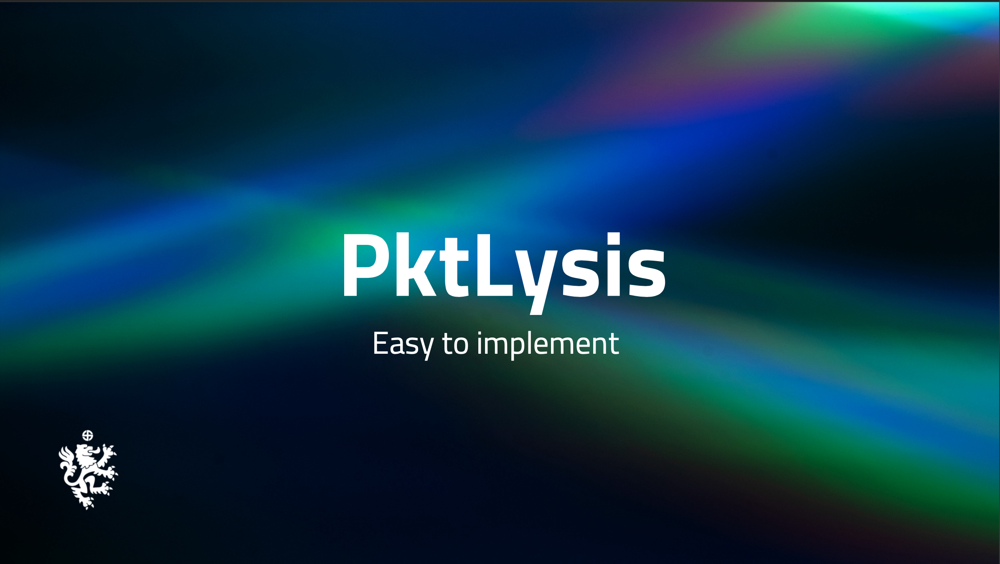

# PKTLysis (NPM Package)

</img>

Software to analyse Network Requests and the json/body of the API's in a Web Application

**Technologies Used :**

- Typescript
- JEST
- NPM

**Branch Format :**

```txt
<nameinitial>/<feature>/<frontend-or-backend>

Eg:
aj/secupdates/fe
```

**Collaborators :**

Naveen Karnamu : https://github.com/Naveen-Karanamu

Arun Jangra : https://github.com/Arun89-crypto/
